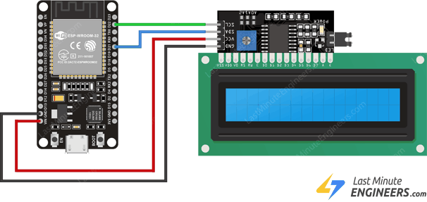

# Configuration
Here's the configuration for the ESP32 and LCD Display. Note that I use the LCD Display with I2C that already soldered with the display.

## Things that you need
1. ESP32
2. LCD Display 16x2 with I2C
3. 4 Female-to-Female Jumper Cable
5. Micro USB

